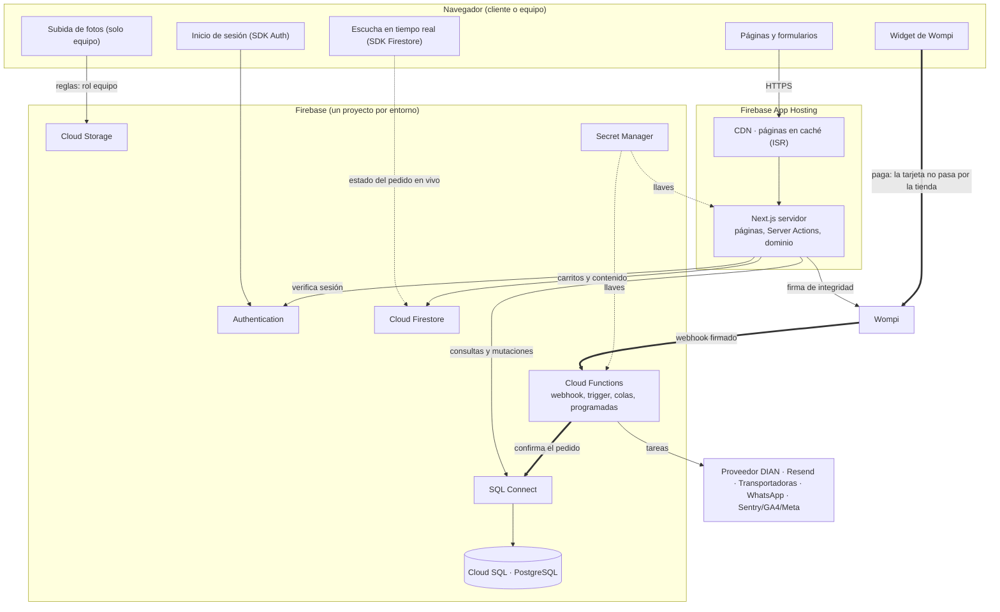
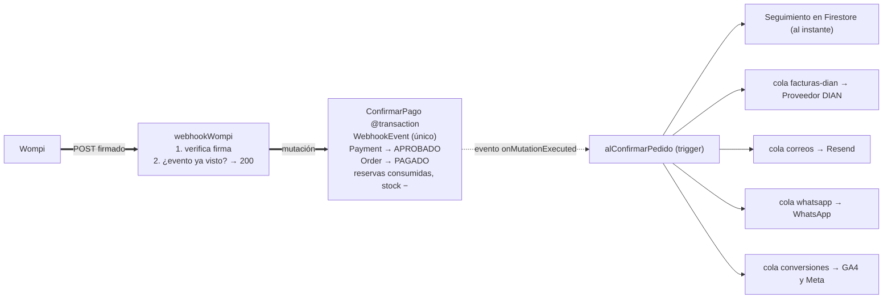
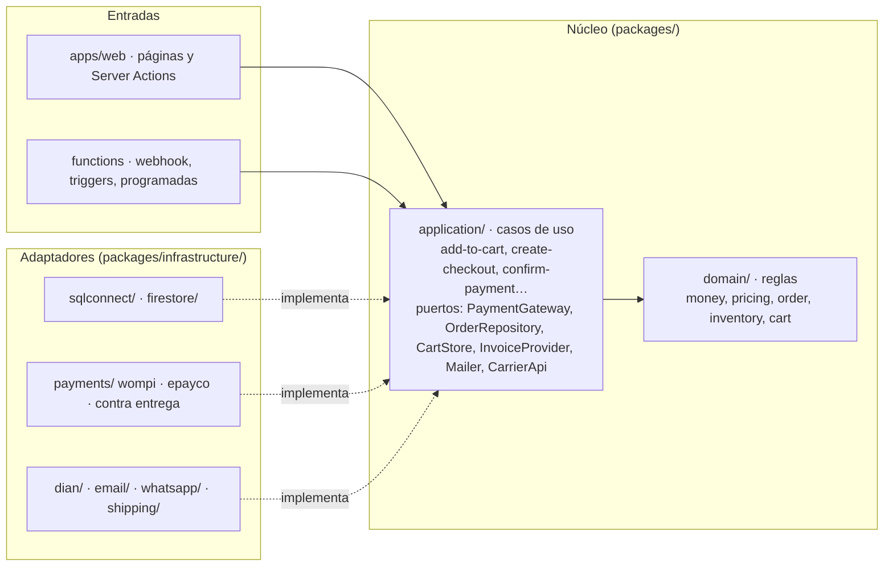
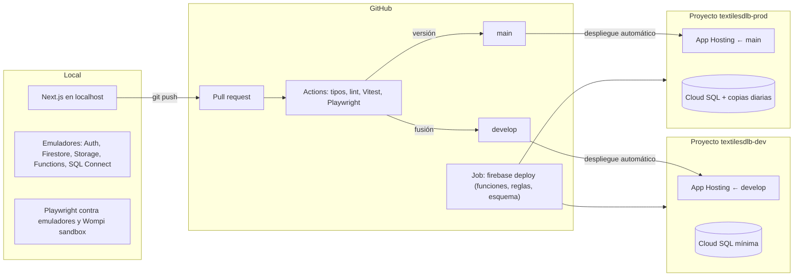

# Arquitectura · Textiles DLB

Versión editable (Mermaid) de los diagramas de arquitectura. La versión ilustrada, con leyenda y notas, está en [`index.html`](index.html) (figuras A1–A5).

> **«Google SQL Connect» = Firebase SQL Connect**, el producto que hasta abril de 2026 se llamaba Firebase Data Connect: PostgreSQL gestionado en Cloud SQL, con esquema y operaciones en GraphQL o SQL nativo, SDK con tipos, consultas en tiempo real y triggers para Cloud Functions.

## Decisiones de partida

| Pieza | Elección | Para qué |
|---|---|---|
| Aplicación | Next.js (App Router), TypeScript estricto, Tailwind CSS v4, shadcn/ui | Tienda, checkout y panel `/admin` |
| Hosting | Firebase App Hosting | Despliegue desde GitHub, CDN y renderizado en servidor |
| Datos del negocio | Firebase SQL Connect sobre Cloud SQL (PostgreSQL) | Catálogo, stock, clientes, pedidos, pagos, facturas |
| Datos concretos | Cloud Firestore | Carritos, seguimiento en vivo, favoritos, contenido, avisos, PQRS |
| Archivos | Cloud Storage | Fotos por color, facturas PDF/XML, fotos de devoluciones |
| Identidad | Firebase Authentication | Cuentas opcionales de cliente y cuentas del equipo con rol |
| Segundo plano | Cloud Functions (2.ª gen.), Cloud Tasks, Cloud Scheduler | Webhook de pagos, factura, correos, WhatsApp, tareas programadas |
| Pagos | Wompi (PSE, Nequi, tarjetas, Daviplata, Bancolombia) + contra entrega | Cobrar, detrás de la interfaz `PaymentGateway` |
| Factura electrónica | Proveedor DIAN (Alegra, Siigo o Factus) | Factura y notas crédito |
| Mensajería | Resend y WhatsApp Business (Cloud API) | Confirmaciones y verificación de contra entrega |
| Observabilidad | Sentry, Cloud Logging, GA4 y Meta desde el servidor | Errores del checkout y conversiones exactas |

## A1 · Vista general

El navegador solo habla directamente con la tienda, Firebase Auth, Firestore (escuchar el estado del pedido) y Wompi (pagar). Todo lo que escribe datos de negocio pasa por el servidor.



## ¿Qué dato vive dónde?

Si tiene precio, stock o valor contable, vive en SQL Connect. Firestore guarda lo efímero, lo que se escucha en tiempo real y lo que tiene forma libre.

| SQL Connect · Cloud SQL | Cloud Firestore | Cloud Storage | Authentication |
|---|---|---|---|
| Catálogo, colores, tallas, variantes | Carritos (TTL 30 días) | Fotos de producto por color | Cuentas de cliente (opcionales) |
| Stock, reservas, movimientos | Seguimiento del pedido en vivo | Facturas y notas crédito | Cuentas del equipo con rol |
| Clientes, direcciones, consentimientos | Favoritos y talla preferida | Fotos de devoluciones | Sesión de servidor (cookie httpOnly) |
| Pedidos, pagos, reembolsos, envíos, facturas | Contenido editable de la portada | Banners de campaña | |
| Cupones, zonas y tarifas de envío | Avisos del panel en vivo | | |
| Eventos de webhook (idempotencia) | PQRS | | |

## A2 · Después de cobrar

El webhook solo verifica y confirma; todo lo demás sale de un trigger y va a colas independientes con reintentos.



- Cada tarea tiene un id determinista (pedido + tipo): si el trigger se repite, Cloud Tasks la descarta.
- Cada cola reintenta con espera creciente sin bloquear a las demás.
- Si el webhook se repite, la inserción de `WebhookEvent` falla y la transacción no hace nada.

## A3 · Capas del código

Las dependencias apuntan siempre hacia el centro: el dominio no importa Firebase, Wompi ni React.



Estructura propuesta del repositorio:

```text
textilesdlb.store/
├─ apps/web/            Next.js (App Router) · backend de App Hosting
├─ functions/           webhook, triggers, colas y tareas programadas
├─ packages/
│  ├─ domain/           dinero, precios, IVA, pedido, inventario (TypeScript puro)
│  ├─ application/      casos de uso y puertos
│  └─ infrastructure/   SQL Connect, Firestore, Storage, Wompi, DIAN, correo, envíos
├─ dataconnect/         esquema y operaciones de SQL Connect (.gql)
├─ firestore.rules · storage.rules · firebase.json
└─ docs/
```

## A4 · Entornos y despliegue



## A5 · Límites de confianza

| Frontera | Qué se comprueba |
|---|---|
| Navegador → servidor | HTTPS, App Check, cookie de sesión verificada, Zod en cada entrada, el servidor recalcula precio, IVA y envío, claims de rol en `/admin`, límite de peticiones |
| Navegador → Firestore / Storage | Reglas de seguridad: seguimiento solo por token exacto (sin listar), favoritos solo del dueño, fotos solo rol equipo |
| Servidor → SQL Connect | Cuenta de servicio con mínimo privilegio; las operaciones de escritura llevan `@auth(level: NO_ACCESS)` y solo se ejecutan con el SDK de administración |
| Navegador → Wompi | Los datos de tarjeta van directo al formulario de Wompi (PCI SAQ-A) |
| Wompi → Functions | Firma del webhook, idempotencia por id de evento |
| Llaves | Secret Manager; nunca en el repositorio |
