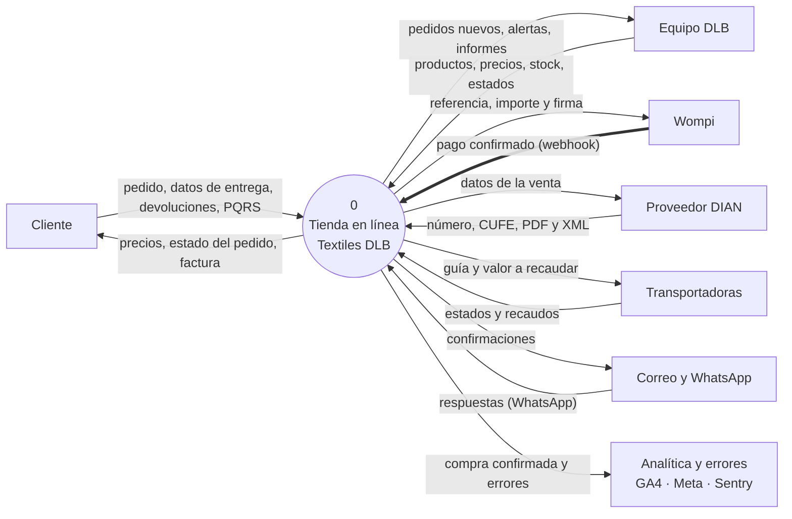
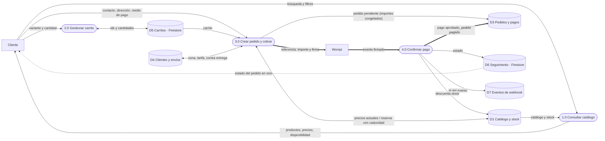
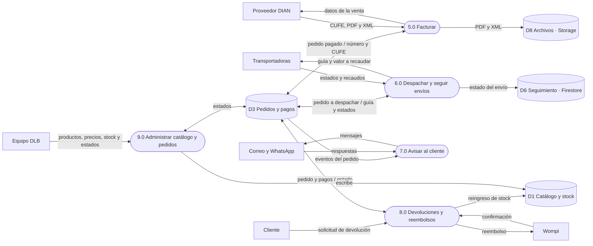
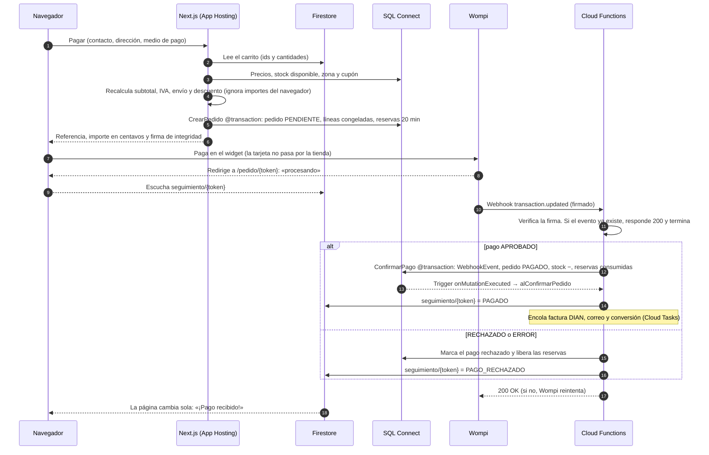
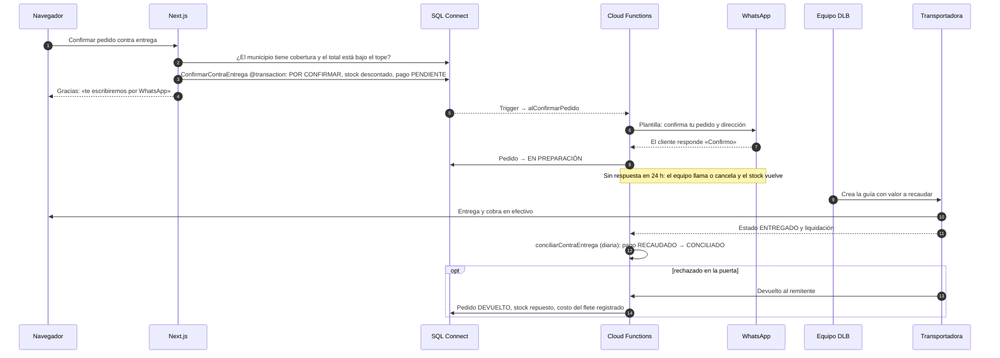
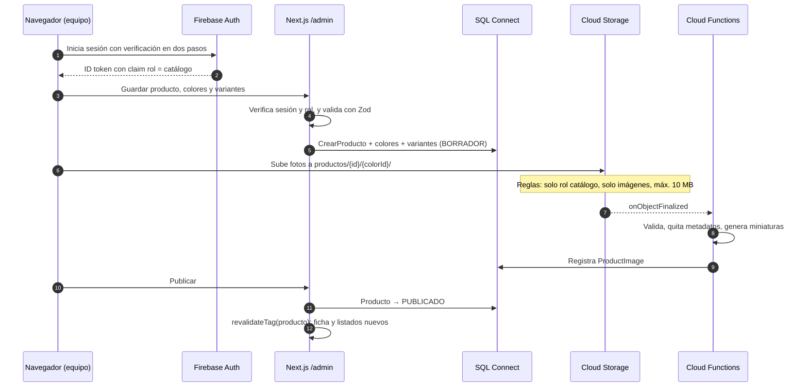
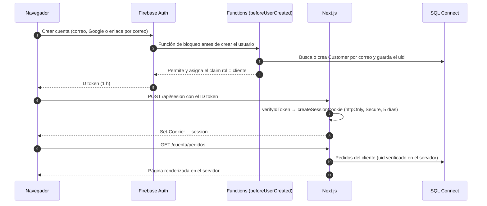
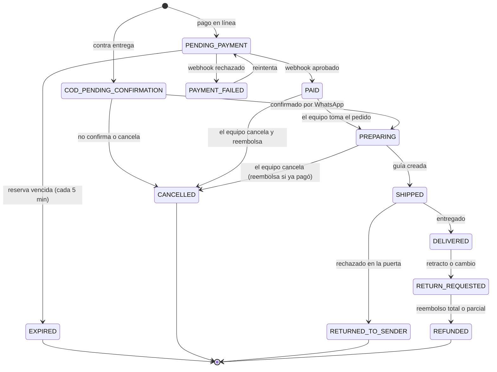

# Flujos de datos · Textiles DLB

Versión editable (Mermaid) de los flujos. La versión ilustrada, con notación Gane–Sarson, está en [`index.html`](index.html) (figuras F1–F8).

En los diagramas de flujo, los procesos van numerados, los almacenes de datos llevan código `D1…D8` y las entidades externas son rectángulos. Las flechas gruesas marcan el camino del dinero.

## F1 · Diagrama de contexto (nivel 0)

## F2 · De la búsqueda al pago confirmado (nivel 1)

## F3 · Después de la compra (nivel 1)

## F4 · Compra con pago en línea

## F5 · Contra entrega

## F6 · Alta de un producto desde el panel

## F7 · Cuentas opcionales y sesión

## F8 · Ciclo de vida del pedido

Es la máquina de estados de `domain/order.ts`: cualquier transición que no esté aquí debe ser rechazada por el dominio.

El cobro contra entrega vive en `Payment`: `PENDIENTE → RECAUDADO` (transportadora) `→ CONCILIADO` (tarea diaria). Cada transición del pedido queda en `OrderStatusHistory` con quién la hizo y cuándo.
