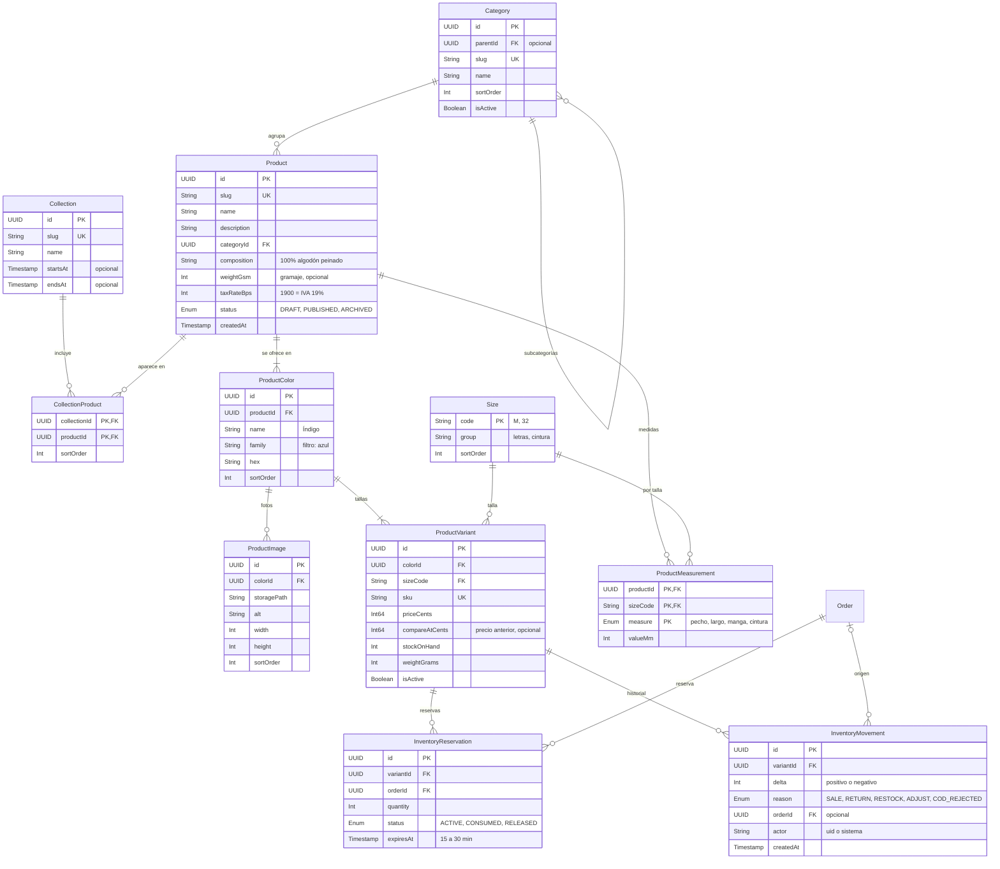
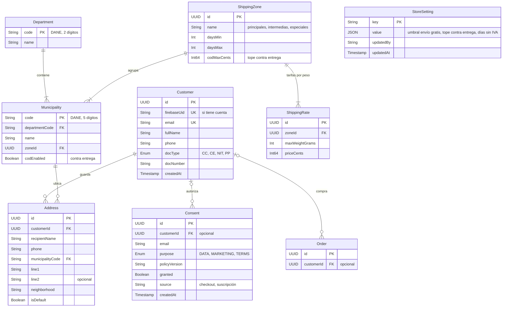

# Modelo de datos · Textiles DLB

Versión editable (Mermaid) del modelo entidad-relación. La versión ilustrada está en [`index.html`](index.html) (figuras D1–D6).

- **SQL Connect (Cloud SQL, PostgreSQL):** 32 tablas en tres dominios. Es la fuente de verdad.
- **Firestore:** 7 colecciones para datos efímeros, en tiempo real o de forma libre.
- Tablas y campos en inglés (serán tipos de TypeScript y GraphQL); textos para el cliente en español.
- Los tipos son orientativos: el esquema definitivo se escribe en el `schema.gql` de SQL Connect.

Los dominios se tocan en cuatro puntos: `InventoryReservation → Order`, `OrderItem → ProductVariant`, `Order → Customer` y `OrderAddress → Municipality`.

## Catálogo e inventario

Producto → Color (con sus fotos) → Variante (color + talla, con SKU, precio y stock).

## Clientes, direcciones y envíos

El cliente puede no tener cuenta; el municipio (código DANE) decide zona, tarifa y cobertura de contra entrega.

## Pedidos, pagos y posventa

El pedido guarda importes desglosados y copias congeladas de líneas y direcciones; todo lo posterior cuelga de él.

```mermaid
erDiagram
    Order ||--|{ OrderItem : "líneas (copia)"
    Order ||--|{ OrderAddress : "envío y factura (copia)"
    Order ||--|{ OrderStatusHistory : "historial"
    Order ||--o{ Payment : "cobros"
    Payment ||--o{ Refund : "reembolsos parciales"
    Order ||--o{ Shipment : "envíos"
    Order ||--o{ Invoice : "factura y notas crédito"
    Order ||--o{ ReturnRequest : "devoluciones"
    ReturnRequest ||--|{ ReturnItem : "incluye"
    OrderItem ||--o{ ReturnItem : "devuelto"
    OrderItem ||--o| Review : "opinión verificada"
    Coupon ||--o{ CouponRedemption : "usos"
    Order ||--o| CouponRedemption : "aplica"
    ProductVariant ||--o{ OrderItem : "referencia"
    Municipality ||--o{ OrderAddress : "ubica"

    Order {
        UUID id PK
        String number UK "PED-2026-00042"
        String publicToken UK "aleatorio, 128 bits o más"
        UUID customerId FK "opcional"
        String email
        String phone
        Enum status "ver ciclo de vida"
        Enum paymentType "ONLINE, COD"
        Int64 subtotalCents
        Int64 discountCents
        Int64 shippingCents
        Int64 taxCents
        Int64 totalCents
        String couponCode "opcional"
        Timestamp createdAt
        Timestamp paidAt
    }
    OrderItem {
        UUID id PK
        UUID orderId FK
        UUID variantId FK
        String sku
        String productName
        String colorName
        String sizeCode
        Int64 unitPriceCents
        Int taxRateBps
        Int quantity
        Int64 lineTotalCents
    }
    OrderAddress {
        UUID orderId PK, FK
        Enum type PK "SHIPPING, BILLING"
        String recipientName
        String municipalityCode FK
        String line1
        String line2
        String neighborhood
    }
    OrderStatusHistory {
        UUID id PK
        UUID orderId FK
        Enum fromStatus
        Enum toStatus
        String actor "uid o sistema"
        Timestamp createdAt
    }
    Payment {
        UUID id PK
        UUID orderId FK
        Enum provider "WOMPI, EPAYCO, COD"
        Enum method "PSE, NEQUI, CARD, DAVIPLATA, BANCOLOMBIA, CASH"
        String reference UK "idempotencia"
        String providerTxId
        Enum status
        Int64 amountCents
        Int installments "cuotas, opcional"
    }
    Refund {
        UUID id PK
        UUID paymentId FK
        Int64 amountCents
        String reason
        Enum status
    }
    Shipment {
        UUID id PK
        UUID orderId FK
        Enum carrier
        String trackingNumber
        Enum status
        Int64 codAmountCents "valor a recaudar"
        Timestamp deliveredAt
    }
    Invoice {
        UUID id PK
        UUID orderId FK
        Enum kind "INVOICE, CREDIT_NOTE"
        String number
        String cufe
        Enum status "PENDING, ISSUED, REJECTED"
        String pdfPath
    }
    ReturnRequest {
        UUID id PK
        UUID orderId FK
        Enum type "RETRACTO, CAMBIO, GARANTIA"
        Enum status
        Timestamp requestedAt
    }
    ReturnItem {
        UUID returnId PK, FK
        UUID orderItemId PK, FK
        Int quantity
    }
    Coupon {
        UUID id PK
        String code UK
        Enum type "PERCENT, FIXED, FREE_SHIPPING"
        Int value
        Int maxUses
        Int usedCount
        Timestamp endsAt
    }
    CouponRedemption {
        UUID id PK
        UUID couponId FK
        UUID orderId UK, FK
    }
    Review {
        UUID id PK
        UUID orderItemId UK, FK
        Int rating "1 a 5"
        String body
        Enum status
    }
    WebhookEvent {
        String id PK "id del evento de Wompi"
        String provider
        String type
        Timestamp receivedAt
    }
    ProductVariant {
        UUID id PK
    }
    Municipality {
        String code PK
    }
```

## Reglas de modelado

1. **Dinero en centavos** (`Int64`, COP). Se formatea solo al mostrar con `Intl.NumberFormat('es-CO')`.
2. **IVA como dato del producto** en puntos básicos (`taxRateBps` = 1900 es 19 %); cada línea del pedido guarda el aplicado.
3. **Lo que se compra es la variante** (color + talla): SKU, precio y stock viven ahí; las fotos, en el color.
4. **El pedido es una fotografía:** nombre, SKU, precio, impuesto, imagen y direcciones se copian y no se recalculan.
5. **Nada se borra:** productos y variantes se archivan.
6. **Dos identificadores por pedido:** `number` legible y `publicToken` aleatorio para el enlace de seguimiento.
7. **Disponible = stock − reservas activas;** la reserva caduca y la libera una tarea programada.
8. **Idempotencia en base de datos:** `Payment.reference` y `WebhookEvent.id` son únicos.
9. **Geografía cerrada:** departamentos y municipios con código DANE.
10. **Consentimientos de solo inserción** con la versión de la política aceptada.

## Firestore

| Colección | Campos | Escribe | Lee |
|---|---|---|---|
| `carritos/{cartId}` | `items[{variantId, cantidad}]`, `uid?`, `contacto?`, `actualizadoEn`, `expiraEn` (TTL 30 días) | Servidor (SDK admin) | Servidor; el dueño si tiene sesión |
| `seguimiento/{token}` | `numero`, `estado`, `pasos[]`, `transportadora`, `guia` (sin datos personales) | Cloud Functions | Quien tenga el token (solo `get`, sin listar) |
| `usuarios/{uid}` | `tallaPreferida`, `medidas {estaturaCm, pesoKg}` | El dueño | El dueño |
| `usuarios/{uid}/favoritos/{productId}` | `agregadoEn` | El dueño | El dueño |
| `contenido/{pagina}` | `bloques[]`, textos, imágenes, vigencia | Rol equipo | Público |
| `avisosEquipo/{id}` | `tipo`, `pedidoId`, `mensaje`, `leido`, `creadoEn` | Cloud Functions | Rol equipo |
| `pqrs/{radicado}` | `tipo`, `mensaje`, `contacto`, `estado`, `venceEn` | Función con App Check | Rol equipo |

## Cloud Storage

| Ruta | Qué guarda | Escribe | Lee |
|---|---|---|---|
| `productos/{productId}/{colorId}/{imagen}` | Fotos originales y miniaturas | Rol catálogo; función `procesarImagen` | Público, vía `next/image` |
| `facturas/{orderId}/{numero}.pdf` y `.xml` | Factura y notas crédito | Función `emitirFactura` | Equipo; el cliente con URL firmada temporal |
| `devoluciones/{returnId}/{foto}` | Fotos del producto devuelto | El cliente, con URL de subida firmada | Equipo |
| `contenido/{archivo}` | Banners y fotos de campaña | Rol contenido | Público |
